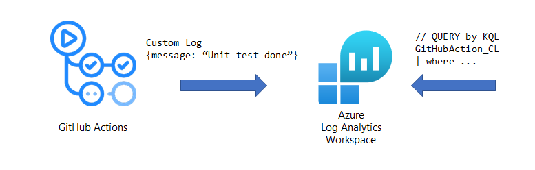

# Azure Monitor Action
[](https://github.com/hoisjp/azure-monitor-action/actions/workflows/test.yml)

This Action lets you send custom log to Azure Monitor Log Analytics workspace from a GitHub workflow.


# Usage

## Prepare secrets
The action requires following 2 secrets. Set the secret value on your github repository, Settings > Secrets
- `LA_WORKSPACE_ID` : get a value from Log Analytics workspace > Overview > Workspace ID
- `LA_AGENT_KEY` : get a value from Log Analytics workspace > Agents management > Primary/Secondary key

## Workflow

```
- name: Send Log to Azure Monitor
  uses: hoisjp/azure-monitor-action@v0.1
  with:
    workspace-id: ${{ secrets.LA_WORKSPACE_ID }}
    agent-key: ${{ secrets.LA_AGENT_KEY }}
    json-body: '{message: "Unit Test Finished.", youCanGiveAnyFieldName: true}'
```

## How to query Log Analytics
You can query with this type name in KQL.
```
GitHubAction_CL
```

# Development

## Code in Main

> First, you'll need to have a reasonably modern version of `node` handy. This won't work with versions older than 9, for instance.

Install the dependencies  
```bash
$ npm install
```

Lint, test and build the typescript and package it for distribution
```bash
$ npm run all
```

Run the tests :heavy_check_mark:  
```bash
$ npm test
> azure-monitor-action@0.0.1 test
> jest

 PASS  __tests__/main.test.ts
...
Test Suites: N passed, N total
Tests:       N passed, N total
Snapshots:   0 total
Time:        10 s
Ran all test suites.
```

## Run on local with `act`
Create `.secrets` for GitHub Secrets values with replacing your actual secrets.
```
LA_WORKSPACE_ID=REPLACE_HERE
LA_AGENT_KEY=REPLACE_HERE
```
And run with `act` command. See also https://github.com/nektos/act to install.
```
$ act -l
ID     Stage  Name   
build  0      build
test   0      test

$ act -j build
...
[build-test/build]   ✅  Success - npm run all

$ act -j test --secret-file .secrets
...
[build-test/test]   ✅  Success - Azure Monitor Action
```

## Publish to a distribution branch

Actions are run from GitHub repos so we will checkin the packed dist folder. 

Then run [ncc](https://github.com/zeit/ncc) and push the results:
```bash
$ npm run package
$ git add dist
$ git commit -a -m "prod dependencies"
$ git push origin releases/v1
```

Note: We recommend using the `--license` option for ncc, which will create a license file for all of the production node modules used in your project.

Your action is now published! :rocket: See the [versioning documentation](https://github.com/actions/toolkit/blob/master/docs/action-versioning.md)
